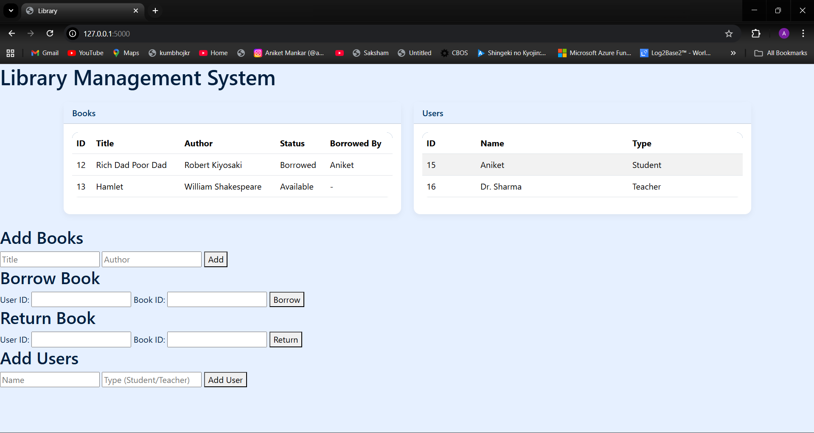
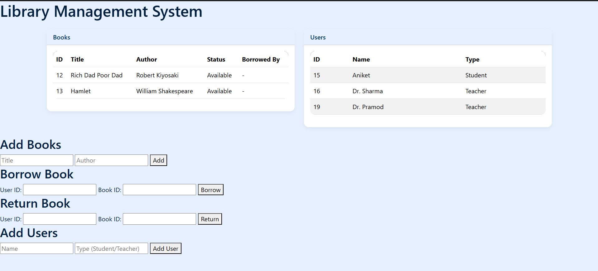
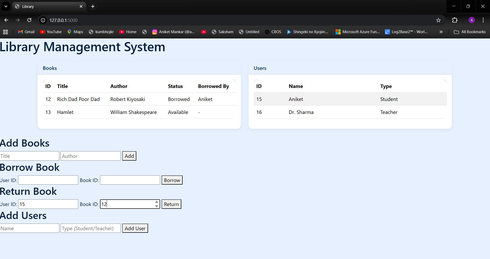
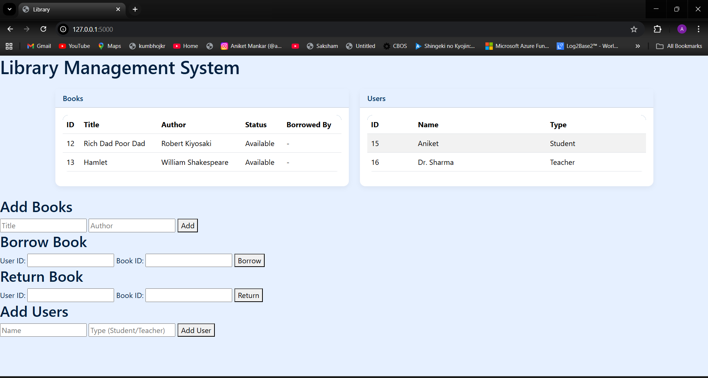

# 📚 Library Management System (LMS)

A simple **Library Management System** built with **Flask + SQLite3**.  
This project lets you **add books, register users, borrow and return books** with a clean UI and blue/white responsive theme.

---

## 🚀 Features
- Add books with title and author  
- Register users (student / teacher / admin)  
- Borrow and return books  
- Track borrowed status with user names  
- REST API endpoints for integration  
- Responsive frontend with forms and tables  

---

## 📂 Project Structure
LibraryManagementSystem/
│── app.py # Flask application
│── db.py # Database functions (SQLite3)
│── requirements.txt # Python dependencies
│── templates/
│ └── index.html # Main HTML template
│── static/
│ └── css/
│ └── style.css # Custom styles


## 📸 Screenshots

### Home Page


### Add User Form


### Return Book


### Book Returned


## 🛠️ Tech Stack
- Python (Flask, sqlite3, pandas)
- SQLite Database
- Excel/CSV Reporting

## ▶️ How to Run
1. Clone the repo:
   ```bash
   git clone https://github.com/your-username/library-management-system.git
   cd library-management-system
2. Install dependencies:
    pip install -r requirements.txt
3. Run Flask app:
    python app.py

# 📡 API ENDPOINTS
    GET /books → Show all available books

    POST /addBook → Add a new book

    POST /borrowBook → Borrow a book

    POST /returnBook → Return a book    
    
🎨 UI Theme

Colors: white + blue shades (azure, navy, light blue)
Fully responsive (works on mobile & desktop)

📜 License
Free to use and modify for learning projects.

👨‍💻 Author

Aniket Mankar